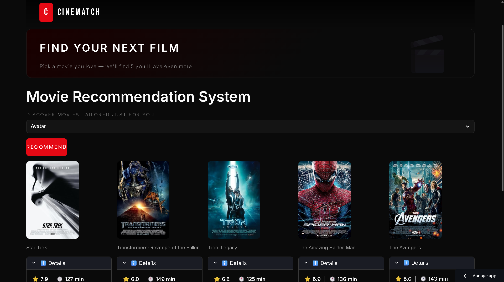

# 🎬 Movie Recommendation System

<p align="center">
  
</p>

<p align="center">
  <a href="https://movie-recommender-vikas.streamlit.app/">
    
  </a>
</p>

---

##  Overview

A full-stack **Movie Recommendation System** built with **Content-Based Filtering** with a live interactive **Streamlit web application** deployed on Streamlit Cloud.

The system recommends movies based on shared **genres** and **release year**, using cosine similarity to identify the most similar titles to any movie a user selects.

> 🚀 **Live Demo:** [Click here to try the app](https://movie-recommender-vikas.streamlit.app/)

---

##  Key Features

-  **Dual Recommendation Engine** — Content-Based + Collaborative Filtering approaches
-  **Cosine Similarity** on genre + year features for smart content matching
   **Smart Title Preprocessing** — fixes suffix-style article errors (e.g. `"Mask, The"` → `"The Mask"`)
-  **Year-Aware Recommendations** — filters movies from 1985–2018 for modern trend alignment
-  **Pickle-Serialized Model** — fast load times using pre-computed similarity matrix
-  **Deployed Web App** — live on Streamlit Cloud, accessible from any browser

---

##  Project Architecture

```
Movies Recommendation System/
│
├── Movie_Recommendation_System_app.py          # Streamlit web app
├── Recommendation_System_Content_Based.ipynb   # Content-based notebook
├── Recommendation_System_Collaborative.ipynb   # Collaborative filtering notebook
│
├── movies.csv                                  # Movie metadata (title, genres)
├── rating.xls                                  # User ratings data
│
├── data_dict.pkl                               # Preprocessed movie data (serialized)
├── similarity.pkl                              # Precomputed cosine similarity matrix
│
├── requirements.txt                            # Python dependencies
└── README.md
```

---

## 🔬 Technical Approach

### 1. Content-Based Filtering

**Feature Engineering Pipeline:**

| Step | Operation |
|------|-----------|
| Load | Read `movies.csv` with title & genre data |
| Clean | Remove duplicates, strip brackets from titles |
| Extract | Parse release year from title string |
| Filter | Keep movies from **1985–2018** for trend relevance |
| Fix | Correct suffix-article titles (`", The"` → `"The "`) |
| Encode | **One-Hot Encode** all 19 unique genres |
| Compute | **Cosine Similarity** across `[year + genre]` feature matrix |
| Serialize | Save similarity matrix & data dict as `.pkl` for fast inference |

The feature vector for each movie consists of its **release year** and **19 binary genre flags** (Action, Adventure, Animation, Comedy, Crime, Documentary, Drama, Fantasy, Film-Noir, Horror, IMAX, Musical, Mystery, Romance, Sci-Fi, Thriller, War, Western, Children).

### 2. Collaborative Filtering

Uses user-item interaction data (`rating.xls`) to discover patterns in how users rate movies — recommending films that users with similar tastes have enjoyed.

---

## 📊 Dataset

| File | Description | Size |
|------|-------------|------|
| `movies.csv` | Movie ID, title (with year), pipe-separated genres | ~483 KB |
| `rating.xls` | User ratings (userId, movieId, rating, timestamp) | ~2,426 KB |

**Data range used:** Movies released between **1985–2018** (to capture modern genre trends).  
**Total unique genres:** 19 (after removing `(no genres listed)` entries).

---

##  Web Application

The Streamlit app allows users to:
1. Select any movie from the dataset via a dropdown
2. Instantly get **Top 5 most similar movie recommendations**
3. View ratings,timelength genres and release year, description alongside recommendations

Built and deployed using:
- **Streamlit** for the interactive frontend
- **Pickle** for loading precomputed similarity matrix (`similarity.pkl`)
- **Pandas** for real-time data lookups from `data_dict.pkl`

---

## 🚀 Getting Started

### Prerequisites

```bash
Python 3.8+
```

### Installation

```bash
# 1. Clone the repository
git clone https://github.com/vikasnagar31/movies-recommendation-system.git
cd movies-recommendation-system

# 2. Create and activate virtual environment
python -m venv myvenv
myvenv\Scripts\activate       

# 3. Install dependencies
pip install -r requirements.txt

# 4. Run the Streamlit app
streamlit run Movie_Recommendation_System_app.py
```

---

##  Dependencies

```
pandas
numpy
scikit-learn
streamlit
pickle5
requests

```

> Full list in `requirements.txt`

---

##  Results & Sample Output

**Input:** `Toy Story`

**Top 5 Content-Based Recommendations:**
```
1. Antz                                     (Animation, Adventure, Comedy | 1998)
2. Toy Story 2                              (Animation, Adventure, Comedy | 1999)
3. The Adventures of Rocky and Bullwinkle   (Animation, Adventure, Comedy | 2018)
4. The Emperor's New Groove                 (Animation, Adventure, Comedy | 2000)
5. Monsters, Inc.                           (Animation, Adventure, Comedy | 2001)
```

---

##  Skills Demonstrated

-  Data Wrangling & Feature Engineering with **Pandas / NumPy**
-  NLP-style text preprocessing (title normalization, suffix correction)
-  **One-Hot Encoding** for multi-label genre classification
-  **Cosine Similarity** for unsupervised similarity computation
-  **Collaborative Filtering** using user-item interaction matrices
-  Model serialization with **Pickle**
-  End-to-end **ML application deployment** with Streamlit Cloud
-  Clean, modular notebook code with reusable UDFs

---

## 🤝 Connect

**Made by [Vikas Nagar]**  
📧 nagarvikas2003@gmail.com  
🔗 [LinkedIn](https://www.linkedin.com/in/vikas31/) | 
---

<p align="center">⭐ If you found this helpful, consider giving it a star!</p>
