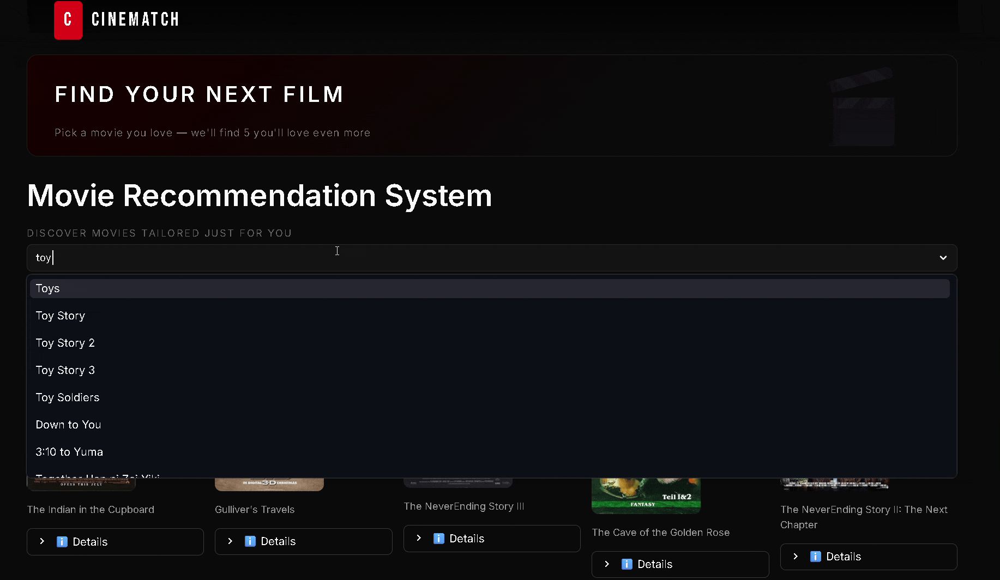

<div align="center">
<h1>🎬 CineMatch — Movie Recommendation System</h1>

<br/>


</div>

---

<div align="center">


</div>

---

## 📖 Overview

**CineMatch** is an end-to-end movie recommendation engine built on the **MovieLens dataset**, using **Content-Based Filtering** as the production recommendation approach. The system recommends movies based on **genre and release-year similarity**, using **cosine similarity** to identify the most relevant titles.

The project also implements and evaluates **User-Based Collaborative Filtering** as a comparative recommendation approach in a separate notebook. The production content-based model powers a live **Streamlit web application** featuring a custom dark, Netflix-inspired interface with **real-time movie posters, ratings, and plot summaries** retrieved through the **OMDb API**.
 
---

## 📑 Table of Contents
- [Demo](#-demo)
- [Features](#-features)
- [Project Structure](#-project-structure)
- [Dataset](#-dataset)
- [Methodology](#-methodology)
- [Results & Sample Output](#-results--sample-output)
- [Tech Stack](#️-tech-stack)
- [Installation](#-installation)
- [Usage](#-usage)
- [Future Improvements](#-future-improvements)
- [Author](#-author)

---

## 🎥 Demo

<div align="center">



<br><br>

<a href="https://cinematch-recommendation-engine.streamlit.app/">
  
</a>

</div>

---

## ✨ Features

- 🎬 **Personalized Top-5 Movie Recommendations** — Generates relevant movie recommendations from any selected title
- 🎯 **Content-Based Recommendation** — Recommends movies using **genre and release-year similarity** with cosine similarity.
- 🤝 **Collaborative Filtering** — Implements **User-Based Collaborative Filtering** as a comparative recommendation approach.
- 🌐 **Interactive Streamlit Application** — Provides a user-friendly, Netflix-inspired interface for exploring recommendations.
- 🖼️ **Real-Time Movie Metadata** — Fetches movie **posters, ratings, and plot summaries** dynamically using the **OMDb API**.
- ⚡ **Fast inference** — precomputed similarity matrix, loaded via pickle, no retraining at runtime
- 🚀 **Cloud Deployment** — Deploys the recommendation engine as a live web application using **Streamlit Cloud**.

---

## 📂 Project Structure

```
Movie-Recommondation-System/
│
├── app/
│   └── Movie_Recommendation_System_app.py       # Streamlit app (CineMatch)
│
├── notebooks/
│   ├── Recommendation System Content Based Filtering.ipynb
│   └── Recommondation System Collaborative based filtering.ipynb
│
├── data/
│   ├── movies.csv
│   ├── rating.csv
│   ├── u.data
│   └── u.item
│
├── models/
│   ├── data_dict.pkl
│   └── similarity.pkl
│
├── assets/
│   ├── Movie-Recommendation-System.gif
│   └── Movie-Recommendation-System.webp
│
├── .gitignore
├── .gitattributes
├── requirements.txt
└── README.md
```

---

## 🗂️ Dataset

Built on the [MovieLens dataset](https://www.kaggle.com/datasets/shubhammehta21/movie-lens-small-latest-dataset):

- **movies.csv** — 9,742 movies (title, genres) → cleaned to a 7,692-movie corpus
- **rating.csv** — 100,836 ratings from 610 users across 9,724 movies

---

## 🧠 Methodology

### 1️⃣ Content-Based Filtering *(primary, deployed)*

- Cleaned raw titles: removed duplicates, extracted release year, fixed 1,113 titles with misplaced articles (`", The"` → `"The "`)
- Filtered to movies released **1985–2018** to keep recommendations relevant to modern viewing trends
- One-hot encoded **19 genres** and combined with release year into a single feature matrix
- Computed a **7,692 × 7,692 cosine similarity matrix** between movies
- For any input movie, the top 5 most similar movies (by similarity score) are returned

### 2️⃣ Collaborative Filtering *(comparison approach)*

- Built a user–item ratings matrix (251 active users × 7,063 movies, filtered to post-2010 activity)
- Computed **user-user cosine similarity**
- For a target user, identified the most similar users and recommended movies they'd watched that the target hadn't yet seen

> The content-based approach was chosen for deployment since it doesn't suffer from the cold-start problem and generalizes well to any movie in the catalog, while collaborative filtering was kept as a comparative experiment.

---

## 📊 Results & Sample Output

**Input:** `Toy Story`

**Top 5 Content-Based Recommendations:**
```
1. Antz                                     (Animation, Adventure, Comedy | 1998)
2. Toy Story 2                              (Animation, Adventure, Comedy | 1999)
3. The Adventures of Rocky and Bullwinkle   (Animation, Adventure, Comedy | 2018)
4. The Emperor's New Groove                 (Animation, Adventure, Comedy | 2000)
5. Monsters, Inc.                           (Animation, Adventure, Comedy | 2001)
```

---


## 🛠️ Tech Stack

| Category | Tools |
|---|---|
| Language | Python |
| Data Processing | Pandas, NumPy |
| Machine Learning | scikit-learn (cosine similarity) |
| Web App | Streamlit |
| External API | OMDb API |
| Deployment Artifacts | Pickle |

---

## ⚙️ Installation

```bash
# Clone the repository
git clone https://github.com/vikasnagar31/Movie-Recommondation-System.git
cd Movie-Recommondation-System

# Create a virtual environment
python -m venv venv
source venv/bin/activate      # On Windows: venv\Scripts\activate

# Install dependencies
pip install -r requirements.txt
```

---

## 🚀 Usage

```bash
cd app
streamlit run Movie_Recommendation_System_app.py
```

Then open `http://localhost:8501` in your browser, pick a movie from the dropdown, and hit **Recommend**.

> ⚠️ **Note:** This app requires an OMDb API key. Get a free key at [omdbapi.com](https://www.omdbapi.com/apikey.aspx) and set it as an environment variable or in `.streamlit/secrets.toml` — never hardcode it directly in the source file.


## 🔮 Future Improvements

- [ ] Hybrid model combining content-based and collaborative signals
- [ ] Incorporate cast, director, and plot-text similarity (TF-IDF / embeddings) for richer content-based matching
- [ ] Deploy collaborative filtering model as a second app mode
- [ ] Host on Streamlit Community Cloud with a live demo link

---

## 👤 Author

**Vikas Nagar**

📧 nagarvikas2003@gmail.com
🔗 [LinkedIn](https://www.linkedin.com/in/vikas31/)

⭐ If you found this project interesting, consider giving it a star!

</div>
